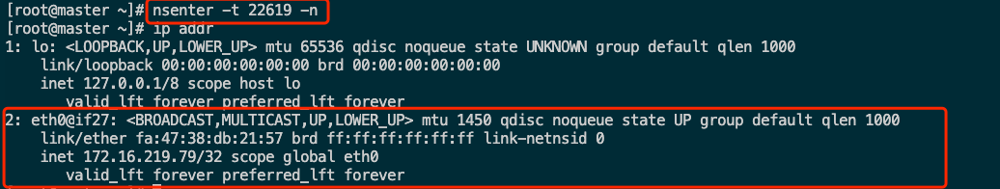
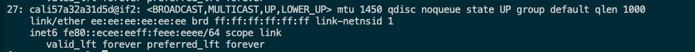

# 利用ns巧妙操作容器

### 背景
    在大多数情况下，我们构建打包的镜像都是精简镜像，里面会缺少很多容器排查问题时的命令工具。我们非常清楚容器是通过namespace和cgroup进行资源隔离和控制。
    所以我们利用namespace自身的能力来操作容器。

### 方法
*  获取容器pid
  ```shell
  # 获取pod
  [root@master ~]# kubectl get pods -o wide 
  NAME                               READY   STATUS    RESTARTS      AGE   IP              NODE     NOMINATED NODE   READINESS GATES
  nginx-deployment-9456bbbf9-779l2   1/1     Running   2 (10d ago)   23d   172.16.219.79   master   <none>           <none>
  # 进入到容器所在node节点
  [root@master ~]# ssh root@master
  [root@master ~]# 
  # 查询对应的容器
  [root@master ~]# docker ps |grep nginx-deployment
  b93052285e7d   295c7be07902                   "nginx -g 'daemon of…"   10 days ago   Up 10 days             k8s_nginx_nginx-deployment-9456bbbf9-779l2_default_83a9e258-b3f7-4490-b0cc-292de13a685f_2
  049672f935f9   k8s.gcr.io/pause:3.6           "/pause"                 3 weeks ago   Up 3 weeks             k8s_POD_nginx-deployment-9456bbbf9-779l2_default_83a9e258-b3f7-4490-b0cc-292de13a685f_0
  # 获取容器对应的pid
  [root@master ~]# docker inspect b93052285e7d |grep -i pid
            "Pid": 22619,
            "PidMode": "",
            "PidsLimit": null,
  ```

* 进入容器的文件目录
  ```
  cd /proc/22619(Pid)/root
   ```
   如图所展示的内容和通过kubectl exec -it 进入容器所看到的内容一模一样
  
   * 可以使用宿主机的所有命令来查看容器中的文件。
   * 可以将宿主机的文件和容器的文件直接互相拷贝   
* 进入容器网络namespace
  ```shell
  nsenter -t 22619(Pid) -n
  ```
  
  同时可以看到网卡名称eh0@if27 
  ```shell
  #执行exit退出namespace
  exit
  ```
  在宿主机上执行ip addr，可以看到编号27的网络信息，和上面的eh0@if27是一对，一个在容器，一个在宿主机的default namesapce下。
  
* 进入容器的
