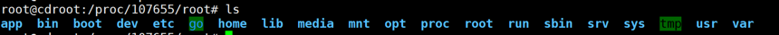

#    巧用namespace的技巧操作容器
> 我们经常一遇到一个问题，就是容器是精简容器，容器里面除了必要的启动命令像go、java等，其他的一些辅助命令基本都是没有安装的，例如
ping、telnet、tcpdump、vim、tail等命令，这让我们在容器里面进行一些调试工作。

###  利用宿主机的命令增、删、改、查容器中文件的方法
  * 查询pod所在node节点  
  
  * ssh到对应的node节点
  * 使用docker命令查询容器id  
  
  * 查询容器对应的进程id
  
  * 进入到进程的root目录，即可看到容器里面的目录内容，对于目录里面的内容都可以进行增删改查
  

### 在宿主机中进入到容器的namespace中,使用宿主机命令获取容器的信息
  * 了解nsenter命令
  * 如上所示pod所对应容器的进程id
  * 使用命令nsenter -t <上面获取到的进程id> -n -u  进入到容器对应的网络namespace中

### 待解决的问题
  * 容器中缺少ping命令，但是需要ping其他容器的hostname。